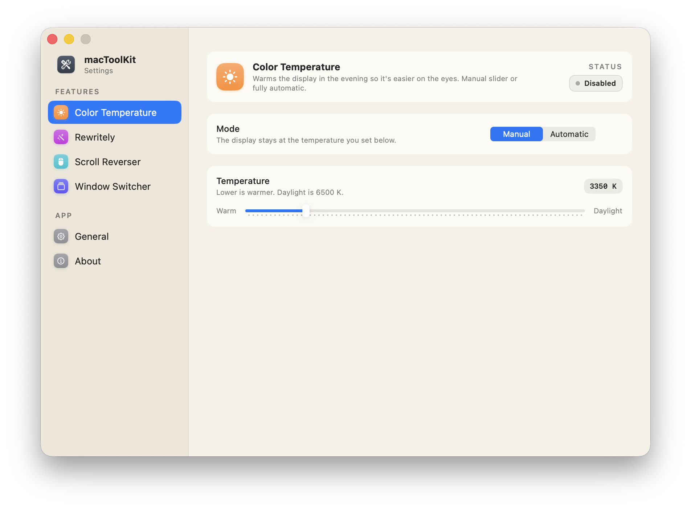
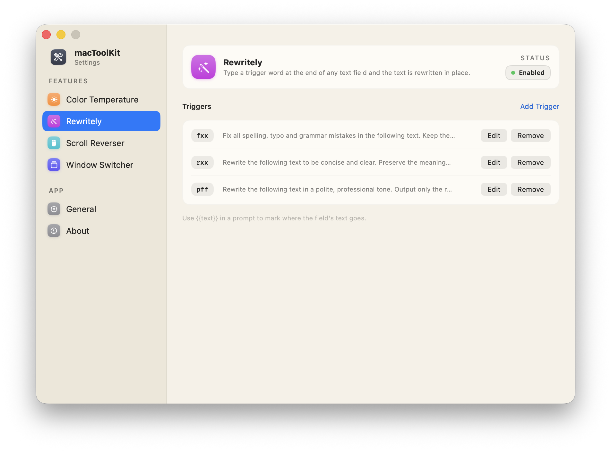
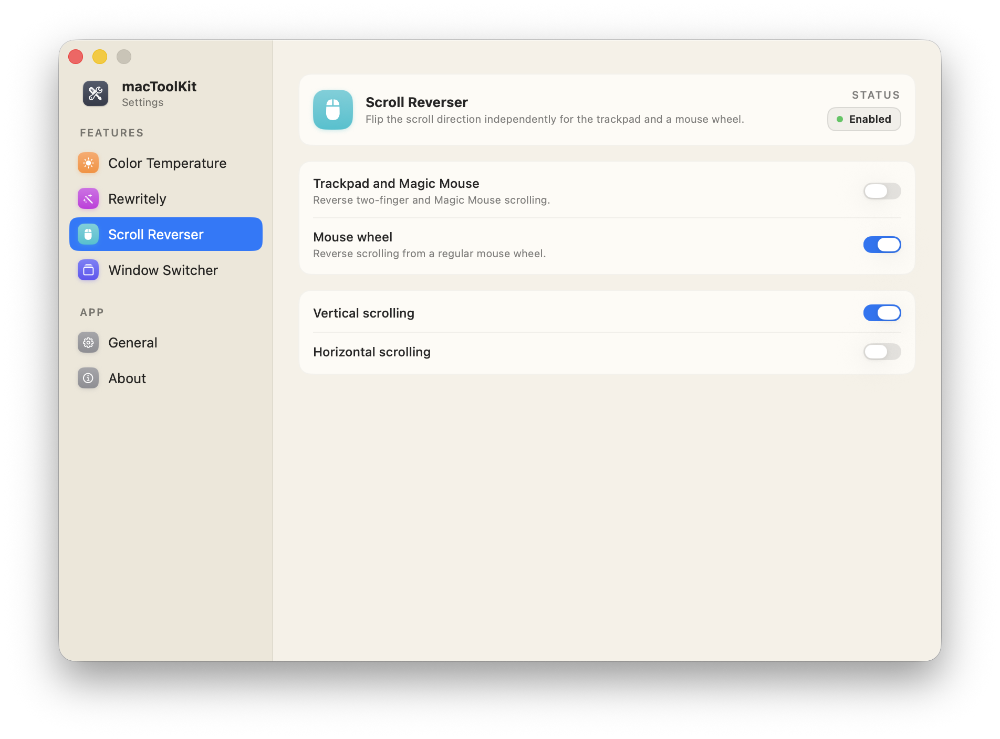
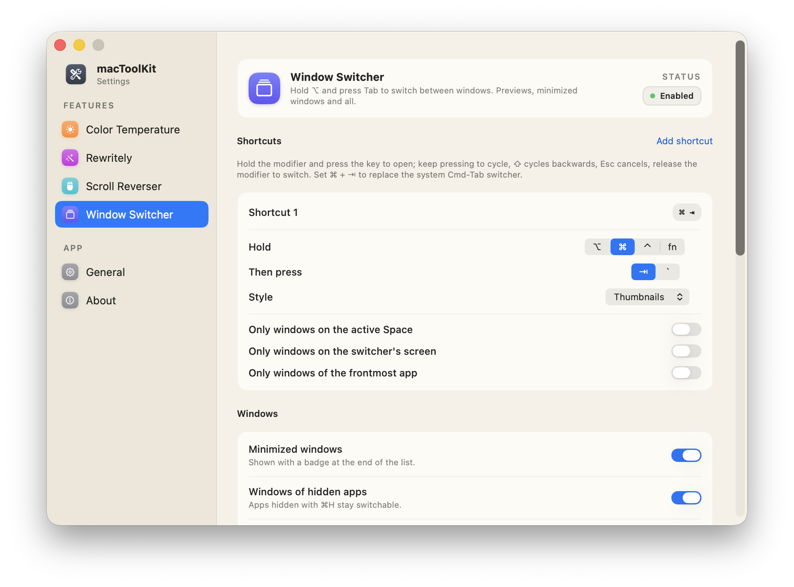
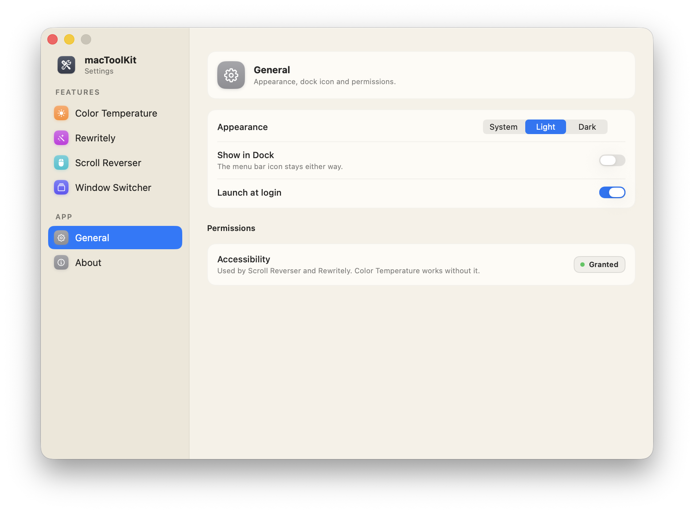

# macToolKit

Menu bar toolkit for macOS 26+ (Apple Silicon). Five tools, individually
toggled from the menu bar icon (Peek is a Quick Look extension
that macOS manages). General settings cover appearance (System/Light/Dark), an
optional dock icon ("Show in Dock") and launch at login.

## Features

| Feature | Permission | Notes |
|---|---|---|
| Color temperature (f.lux style) | none | Manual slider or sunset/sunrise auto mode |
| Rewritely — trigger-word AI rewrite | Accessibility | Apple Intelligence on-device; default triggers `;;fix` `;;tight` `;;prof` |
| Scroll Reverser | Accessibility | Trackpad/mouse and vertical/horizontal independently |
| Window Switcher | Accessibility (+ Screen Recording for thumbnails) | Alt-Tab style switcher; thumbnails, app icons or titles; per-shortcut slots |
| Peek — folder and zip Quick Look | none | Press Space on a folder or a `.zip` in Finder; browsable tree with sizes, sorting and depth preload |

## Screenshots

| Color Temperature | Rewritely |
|---|---|
|  |  |

| Scroll Reverser | Window Switcher |
|---|---|
|  |  |

| General |
|---|
|  |

## Install

### Homebrew (recommended)

```sh
brew install --cask aletisunil/tap/mactoolkit
```

Or tap once, then use the short name:

```sh
brew tap aletisunil/tap
brew install --cask mactoolkit
```

Upgrade:

```sh
brew upgrade --cask mactoolkit
```

Uninstall:

```sh
brew uninstall --zap --cask mactoolkit  # app, settings and caches
```

### Manual

Download the latest `macToolKit.dmg` from
[Releases](https://github.com/aletisunil/macToolKit/releases), open it and
drag macToolKit to Applications. The app is Developer ID signed and
notarized — no Gatekeeper warnings.

After installing either way, see [First-run setup](#first-run-setup) for the
Accessibility permissions each tool needs.

### Uninstalling

Homebrew installs: `brew uninstall --zap --cask mactoolkit`, which takes the
app, its settings and its caches, and Homebrew's own receipt with it.

Manual installs: turn **Launch at login** off in Settings → General, quit
macToolKit, and drag it from Applications to the Trash. The Peek Quick Look
extension ships *inside* the app bundle, so it goes at the same time; its row in
System Settings disappears whenever LaunchServices next rescans.

Settings live outside the bundle and stay behind. To clear them:

```sh
rm -rf ~/Library/Group\ Containers/5432YAY2UX.com.sunilaleti.mactoolkit
rm -f ~/Library/Preferences/com.sunilaleti.mactoolkit.plist
```

Accessibility and Screen Recording grants have to be removed by hand in System
Settings — no app can revoke its own TCC entries.

## Build

```sh
brew install xcodegen   # once
xcodegen generate
xcodebuild -project macToolKit.xcodeproj -scheme macToolKit -configuration Debug build
```

Run the tests with:

```sh
xcodebuild -project macToolKit.xcodeproj -scheme macToolKit -configuration Debug test
```

Signing uses the local "Apple Development" identity (team 5432YAY2UX, set in
project.yml). The app and the Quick Look extension share a team-prefixed app
group (`5432YAY2UX.com.sunilaleti.mactoolkit`, `APP_GROUP_ID` in project.yml)
for the Peek settings, so no provisioning profile is needed.

## Releasing

Push a version tag and CI builds, signs, notarizes and publishes a `.dmg` +
`.zip` to GitHub Releases (see `.github/workflows/release.yml`):

```sh
git tag v1.0.0
git push origin v1.0.0
```

Local release build: `Scripts/release.sh 1.0.0` (needs the Developer ID
certificate and a saved `notarytool` keychain profile named `macToolKit`).

## First-run setup

1. **Accessibility** — needed for Scroll Reverser, Rewritely and Window
   Switcher; grant from Settings → General when prompted.
2. **Screen Recording** — optional, only for Window Switcher thumbnails;
   without it the switcher falls back to app-icon tiles.
3. **Rewritely** — requires Apple Intelligence enabled in System Settings.
4. Auto color temperature can use Location (optional) or fixed times.

## How Rewritely works

Type a trigger word at the very end of any text field (e.g.
`fix this sentnce pls ;;fix`). The app reads the field via Accessibility,
strips the trigger, runs your per-trigger prompt (`{{text}}` = the field text)
through the on-device model, and replaces the text in place. Fields without a
settable AX value (some Electron/web views) use a clipboard fallback that
selects to the start of the field so text after the trigger is preserved.

## Architecture notes

- `macToolKit/` — main app (non-sandboxed). `Features/` one folder per tool.
- Gamma tables (`CGSetDisplayTransferByTable`) are reset by macOS on wake and
  display changes; `ColorTemperatureController` reapplies automatically and
  `CGDisplayRestoreColorSyncSettings()` restores on disable/quit.
- Scroll Reverser and Window Switcher event taps run on dedicated threads
  (Rewritely's listen-only tap stays on the main run loop). All three recover
  from `tapDisabledByTimeout` both in the tap callback and from a 2 s watchdog,
  since the disable notification itself can be missed.
- Peek settings live in the shared app group container, which is how the
  sandboxed Quick Look extension reads what the app writes. Values from older
  builds, which used `NSGlobalDomain`, are migrated on first launch and removed
  from there.
- Peek reads a `.zip` through its central directory only
  (`Shared/ZipCentralDirectory.swift`) — two bounded reads, no decompression, so
  a multi-gigabyte archive lists as fast as a small one. Folders and archives
  reach the panel through the same `PeekContentProvider`.
- Quick Look's window chrome (the close and full-screen buttons) belongs to the
  host process, not the extension — there is no API to hide it, so the header
  inset adapts instead.

## License

[MIT](LICENSE)
